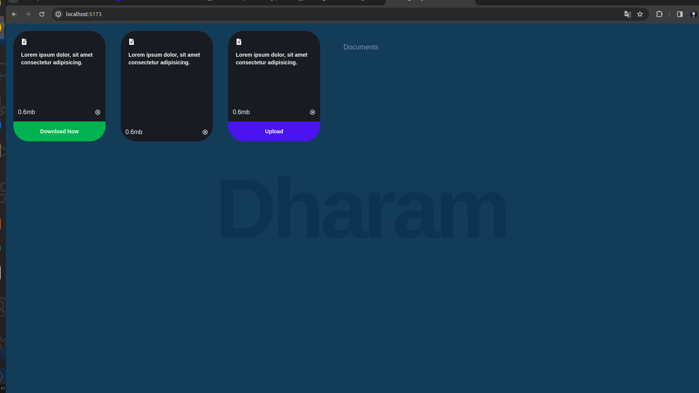

# React-Landing-Page-Upflairs

This project demonstrates a basic Drag page using the React (React.js, Tailwind, framer motion, Hooks,) stack.

## Overview

- **React.js**: Front-end framework for building user interfaces.

## Screenshots


*Screenshot of the Main page.*

## Features

- Tailwind Use in this project.
- Responsive design for a better user experience.

## Getting Started

1. Clone the repository:

    ```bash
    git clone https://github.com/Dharam-IN/react-drag-project
    ```

2. Install dependencies:

    ```bash
    cd your-repo
    npm install
    ```

3. Set up the environment variables:

    Create a `.env` file in the root directory and add the following:

    ```env
    REACT_APP_API=http://localhost:your-api-port
    ```

4. Run the application:

    ```bash
    npm start
    ```

    The app will be available at `http://localhost:5173` by default.

## Contributing

Feel free to contribute by opening issues or pull requests. Feedback and suggestions are welcome!

## License

<!-- This project is licensed under the [MIT License](LICENSE). -->

